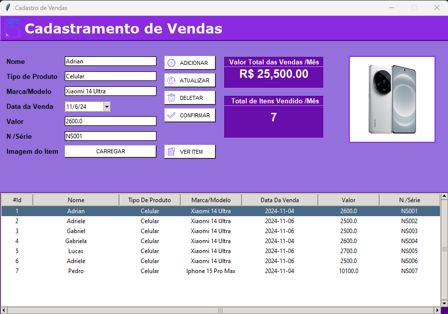

# Inventory Manager – Python

Sistema de gerenciamento de estoque desenvolvido em **Python**, utilizando **SQLite** como banco de dados. O projeto foi estruturado com separação entre lógica de negócio (backend) e interface, visando organização, manutenção e evolução futura.

---

## 📌 Visão Geral

Este projeto tem como objetivo oferecer um **gerenciador de inventário simples, funcional e extensível**, permitindo operações básicas de cadastro, leitura, atualização e exclusão de dados (CRUD).

A versão atual representa a **primeira versão estável (v1.0)**, com o núcleo do sistema implementado e em funcionamento.

---

## 🧩 Funcionalidades

* Cadastro de itens no banco de dados
* Listagem de registros
* Atualização de informações
* Exclusão de registros
* Persistência de dados com SQLite
* Estrutura modularizada (backend separado)

---

## 🗂️ Estrutura do Projeto

```
inventory-manager-python/
│
├── main.py                 # Arquivo principal (inicializa a interface)
│
├── backend/                # Lógica de negócio e acesso a dados
│   ├── crud.py              # Operações CRUD (SQLite)
│
├── frontend/               # Interface gráfica (Tkinter)
│   ├── color.py             # Paleta de cores e estilos
│   └── icones/              # Ícones utilizados na interface
│
├── database/               # Banco de dados
│   └── dados.db
│
└── README.md
```

---

## 🖼️ Imagens do Projeto

### Tela principal do sistema




---

## ⚙️ Tecnologias Utilizadas

- Python 3
- SQLite3
- Tkinter
- Pillow (PIL)
- tkcalendar

---

## ▶️ Como Executar o Projeto

1. Certifique-se de ter o Python instalado.
2. Instale as dependências necessárias:
   ```bash
   pip install Pillow tkcalendar
   ```
3. Acesse a pasta do projeto e execute o arquivo principal:
   ```bash
   python main.py
   ```

---

## 🚧 Status do Projeto

* ✅ Versão 1.0 organizada e funcional
* 🔧 Estrutura separada em Backend e Frontend

---

## 📄 Licença

Este projeto é de uso educacional e pessoal. Sinta-se livre para estudar, modificar e evoluir o código.
